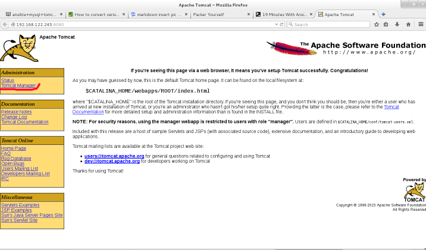
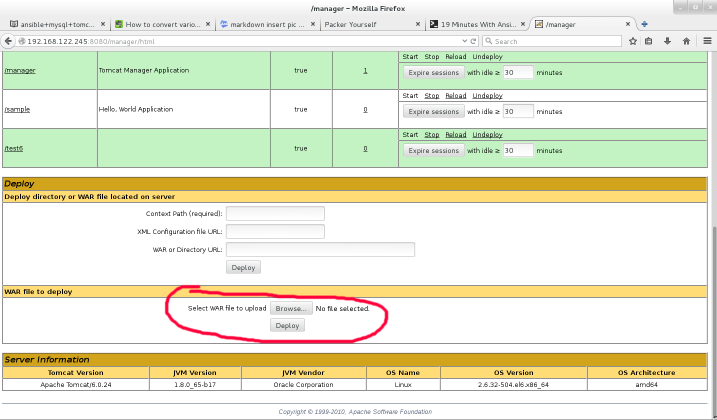
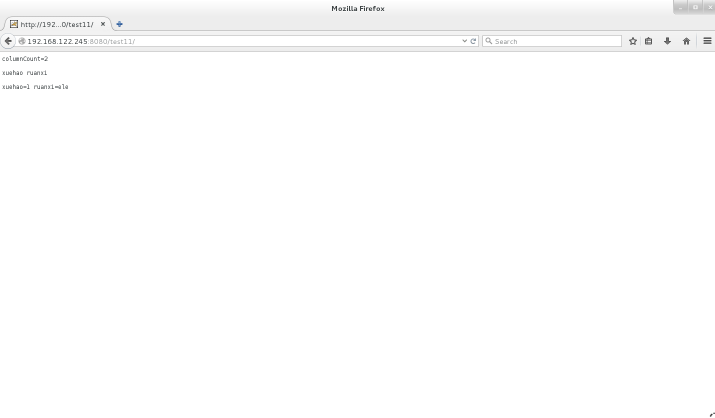

# ansible+mysql+tomcat
## mysql镜像制作

用packer制作centos6.6镜像       
```shell
Packer build centos6-6.json      
```
在镜像中安装mysql     
```shell
#sed -i 's#SELINUX=enforcing#SELINUX=disabled#' /etc/selinux/config
#yum install -y -q mysql-server mysql mysql-deve
#service mysqld start
#chkconfig mysqld on
#mysql -uroot -e "grant all privileges on *.* to 'root'@'%' identified by 'engine' with grant option;"
#mysql -uroot -e "create database testdb;"
#mysql -uroot -e "use testdb;create table account(id int(4),name char(20));insert into account values(1,'jack');"
```
在virt-manager默认网段中自动分配到的ip： `192.168.122.68`      

## Tomcat镜像制作    
用packer制作centos6.6镜像     
```shell
packer build centos6-6.json
```
在镜像中安装tomcat    
```shell
#sed -i 's#SELINUX=enforcing#SELINUX=disabled#' /etc/selinux/config
#yum install -y -q java-1.8.0-openjdk
#yum install -y -q tomcat6  tomcat6-webapps tomcat6-admin-webapps
#sed -i 's#</tomcat-users>#<role rolename="manager" /><user username="clouder" password="engine" roles="manager" /></tomcat-users>#' /etc/tomcat6/tomcat-users.xml
#service tomcat6 start
#chkconfig tomcat6 on
```
在virt-manager默认网段中自动分配到的ip： `192.168.122.245`     

## 部署webapp
从Github下载HelloTomcat。      
```shell
#git clone https://github.com/pjq/HelloTomcat.git
#cd HelloTomcat
```
修改WEB-INF/src/DataManager.java中的数据库连接改成读配置文件。      
```java
+import java.io.*;
+import java.util.Properties;
...
        public Connection getConnection() {
-                //String url = "jdbc:mysql://192.168.122.68:3306/testdb";
-                //String username = "root";
-                //String password = "engine";
+InputStream inputStream = this.getClass().getClassLoader().getResourceAsStream("mysql.properties");
+Properties p = new Properties();
+try {
+p.load(inputStream);
+} catch (IOException e1) {
+e1.printStackTrace();
+}
+		String url ="jdbc:mysql://"+ p.getProperty("ip")+":3306/"+ p.getProperty("dbname");
+		String username = p.getProperty("user");
+		String password = p.getProperty("passwd");   

```
修改WEB-INF/src/QueryDatabase.java中的表名改成读配置文件。
```java
+import java.io.*;
+import java.util.Properties;
...
+InputStream inputStream = this.getClass().getClassLoader().getResourceAsStream("mysql.properties");   
+Properties p = new Properties();   
+try {   
+p.load(inputStream);   
+} catch (IOException e1) {   
+e1.printStackTrace();   
+} 
+		String sqlString = "SELECT *  from "+p.getProperty("tablename");
-		//String sqlString = "SELECT *  from tablea";
```
重新编译DataManager.java、QueryDatabase.java，将生成的class文件替换原来的class
```shell
＃cd WEB-INF/src/
#javac DataManager.java
#javac -classpath .:/usr/share/java/tomcat-servlet-3.0-api.jar QueryDatabase.java
#\cp DataManager.class QueryDatabase.class ../classes
```
添加配置文件WEB-INF/classes/mysql.properties
```text
ip=192.168.122.245 
user=root
passwd=engine
dbname=testdb
tablename=account
```
修改WEB-INF/web.xml路由设置
```text
        <servlet-mapping>
                <servlet-name>query</servlet-name>
                <url-pattern>/</url-pattern>
        </servlet-mapping>
```
制作war
```shell
#cd HelloTomcat
#jar cvf test11.war *
```
将以上制作的war文件部署到tomcat中。   
登陆tomcat首页http://192.168.122.245:8080   
    
进入管理页面user:clouder password:engine  

选择部署方式：WAR file to deploy 选择文件：HelloTomcat/test11.war   
打开应用页面查看表数据http://192.168.122.245:8080/test11    

## Ansible playbook
实现的功能是在tomcat上部署应用，修改上应用的配置文件，配置文件里一般是数据库ip、用户、密码等内容。
playbook目录结构     
```list
├── hosts
├── hosts~
├── roles
│   ├── mysql
│   │   ├── files
│   │   ├── tasks
│   │   │   └── main.yml
│   │   └── templates
│   │       └── my.cnf
│   └── tomcat
│       ├── files
│       │   └── HelloTomcat
│       │       └── test11.war
│       ├── handlers
│       │   └── main.yml
│       ├── tasks
│       │   └── main.yml
│       └── templates
│           └── mysql.properties
└── roles.yml

```
File hosts 指定ip、用户、密码和变量
```text
# hosts
[mysql]
192.168.122.68 ansible_ssh_user=root ansible_ssh_pass=engine

[tomcat]
192.168.122.245 ansible_ssh_user=root ansible_ssh_pass=engine

[tomcat:vars]
webapp=/usr/share/tomcat6/webapps
mysql_ip=192.168.122.171
mysql_user=root
mysql_password=engine
mysql_dbname=testdb
mysql_tablename=aaa
```
File roles.yml
```
- hosts: tomcat
  roles:
    - { role: tomcat }
- hosts: mysql
  roles:
    - { role: mysql }
```
File roles/tomcat/tasks/main.yml主要执行流程。
```text
  - name: clean existing website content
    shell: rm -rf {{webapp}}/test11 && rm -f {{webapp}}/test11.war 
  - name: copy webapp
    copy: src=HelloTomcat/test11.war dest={{webapp}}/ owner=tomcat group=tomcat
  - name: sleep for 5 seconds
    shell: /bin/sleep 5 
  - name: copy mysql.properties
    template: src=mysql.properties dest={{webapp}}/test11/WEB-INF/classes/mysql.properties  owner=tomcat group=tomcat mode=0644
    notify: restart tomcat6
```
File roles/tomcat/templates/mysql.properties变量后面不能有空格
```
ip={{mysql_ip}}
user={{mysql_user}}
passwd={{mysql_password}}
dbname={{mysql_dbname}}
tablename={{mysql_tablename}}
```
File roles/mysql/tasks/main.yml
```
  - name: copy my.cnf
    template: src=my.cnf dest=/etc/my.cnf
  - name: restart mysqld
    service: name=mysqld state=restarted
```
File roles/mysql/templates/my.cnf
```
[mysqld]
datadir=/var/lib/mysql
socket=/var/lib/mysql/mysql.sock
user=mysql
# Disabling symbolic-links is recommended to prevent assorted security risks
symbolic-links=0

[mysqld_safe]
log-error=/var/log/mysqld.log
pid-file=/var/run/mysqld/mysqld.pid
```
修改ip时只要修改hosts文件中的值，再执行以下命令：
```shell
ansible-playbook -i hosts roles.yml
```
